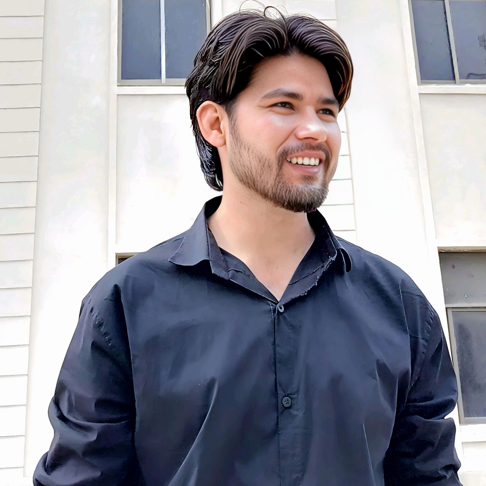

# ✨ Dream Team Members

Welcome to the **Dream Team Members** project! 🌟

This responsive and beautifully crafted UI showcases a professional team layout designed to highlight key team members and their roles in a visually appealing manner. Built using **HTML** and **CSS**, this project is perfect for company websites, portfolios, or any digital product needing a "Meet the Team" section.

---

## 👥 Overview

> "Great teams are built on trust, driven by purpose, and united by respect.  
> Each member brings a spark — together, they create brilliance.  
> Alone we can do so little; together we achieve greatness."  

This project highlights a team of professionals with photos, names, and roles, organized in a clean and mobile-friendly layout.

---

## 🚀 Features

- ✅ Fully responsive layout (desktop, tablet, and mobile support)
- 🎨 Elegant typography using Google Fonts (Nunito)
- 🧱 Modular Flexbox-based grid structure
- 🧑‍🤝‍🧑 Clear representation of team hierarchy
- 🖼️ Placeholder images for each team member (easily replaceable)

---

## 🧑‍💼 Team Members Included

| Name          | Role               |
|---------------|--------------------|
| Ejaz Ahmed    | CEO 👔              |
| Md. Nawaz     | CTO 💻              |
| Walayat Ali   | Health Care 🏥      |
| Ejaz Ali      | Development Head 🧠 |
| Ali           | HR Manager 📋       |
| Jhon Ali      | Design Head 🎨      |

---

## 🛠️ Technologies Used

- **HTML5** 🧱
- **CSS3** 🎨
- **Google Fonts (Nunito)**

---

## 📁 Project Structure

```plaintext
Dream-Team/
│
├── index.html          # Main HTML structure
├── style.css           # All styling rules
└── Img/                # Folder for member images
```

---

## 📸 Screenshots




---

## 📱 Responsive Design

This layout adapts beautifully to all screen sizes:

- ✅ Desktop  
- ✅ Tablet  
- ✅ Mobile  

Built using a combination of **media queries** and **custom responsive classes**, it ensures optimal viewing on every device.

---

## 🧩 How to Use

1. Clone this repository  
   ```bash
   git clone https://github.com/Owais41111/HTML-Dream-Team-Page
   ```
2. Open the `index.html` file in your browser.
3. Replace image files and update member information as needed in the HTML.

---

## 🎯 Customization Tips

- Swap out the images in the `/Img` folder with your team members’ photos.
- Update team titles and names directly in `index.html`.
- Modify styles in `style.css` to match your brand colors or fonts.

---

## ❤️ Credits

Thanks to all the team members featured and the open-source design inspiration that made this UI possible.

---

## 📄 License

This project is open-source and available under the [MIT License](LICENSE).

---

## 🙌 Contributing

Pull requests are welcome! If you'd like to contribute, improve responsiveness, or add new design ideas — feel free to fork the repo and create a PR.

---

## 🌐 Live Demo (Optional)

If hosted online (e.g., GitHub Pages or Netlify), add your link here:
**👉 [View Live](https://owais41111.github.io/HTML-Dream-Team-Page/)**

---

> Made with 💙 to celebrate teamwork.

```
